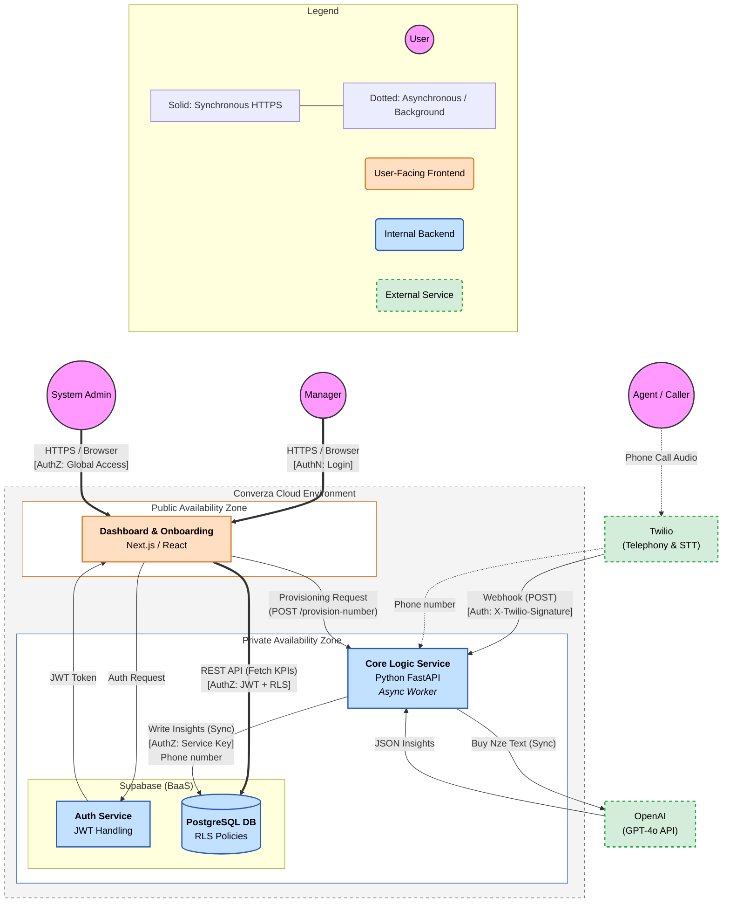
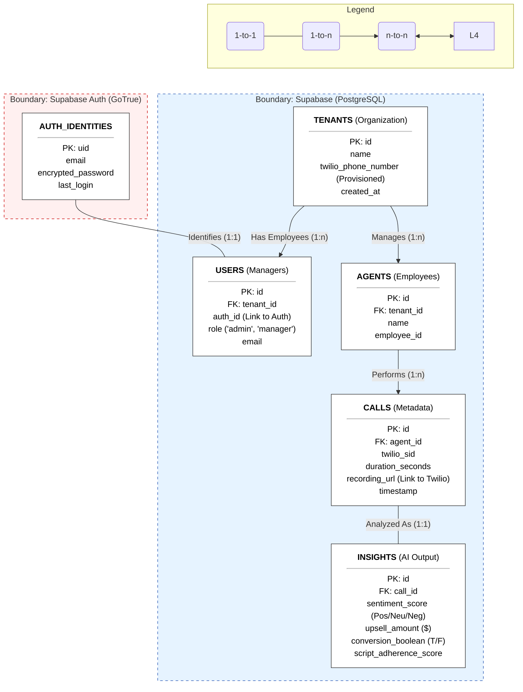

# Converza: Architectural Design Package (after refactors)

## 1. Project Overview

### 1.1 Problem Summary

**The System:** Converza is a Call Performance Intelligence Platform built to unlock the revenue hidden within customer conversations. It transforms the "operational black box" of front-desk and call-center interactions into actionable business intelligence.

**The Users:**

- **Managers (Primary):** Operations leaders who require objective data to coach agents, standardize quality, and drive bottom-line results.

- **System Admins:** Internal monitors who oversee API usage and cost-efficiency to protect our 80% gross margin target.

- **Agents (Passive):** Front-line staff whose performance is quantified via AI-driven KPIs.

**The Problem:** Management currently lacks a systematic way to measure the financial outcomes of phone calls. Manual monitoring is anecdotal and unscalable. Converza solves this by providing 100% visibility into every call, linking agent behavior directly to revenue outcomes like Conversion Rate (%) and Upsell Success ($).

### 1.2 Core User Flows

1. **Frictionless Onboarding:** A Manager provisions a Twilio number via the Converza portal, immediately enabling call recording and analysis without complex IT projects.

2. **Automated Call Ingestion:** An Agent receives a call; the system passively records and generates a high-accuracy transcript via Twilio.

3. **AI Insight Generation:** The "Insight Engine" (GPT-4o) analyzes the transcript asynchronously to extract ROI metrics (Sentiment, Upsell, Conversion).

4. **Performance Dashboard Review:** The Manager accesses a unified dashboard to visualize team-wide performance and revenue generated.

5. **Coaching Drill-Down:** The Manager identifies a low-performing interaction and clicks through to review the specific recording and AI-generated coaching notes.

### 1.3 Requirements

**Functional:**

- Automated ingestion of calls via Twilio webhooks.

- AI-driven extraction of revenue-centric KPIs.

- Multi-tenant dashboard with drill-down capabilities for manual review.

**Non-Functional:**

- **Scalability:** Stateless logic services to support horizontal growth.

- **Observability:** Detailed monitoring of OpenAI token consumption to maintain an 80% gross margin.

- **Security:** Multi-tenant data isolation via PostgreSQL Row Level Security (RLS).

- **Availability:** Asynchronous processing ensures that analysis spikes do not impact dashboard performance.

## 2. Architecture

### 2.1 High-Level Architecture Diagram

### 2.2 Architectural Style Decision

Converza employs an **Event-Driven Service-Oriented Architecture (SOA)** with a Backend-as-a-Service (BaaS) foundation.

**Justification:** This hybrid approach allows us to focus engineering resources on our "Insight Engine" while offloading commoditized infrastructure (Auth, standard CRUD) to Supabase. The event-driven nature ensures we handle Twilio webhooks with high reliability and low latency.

### 2.3 Component Breakdown

- **Next.js Dashboard:** A high-performance React frontend optimized for data visualization and RLS-secured data fetching.

- **FastAPI Logic Service:** A specialized Python service designed for asynchronous background tasks, prompt engineering, and external API orchestration.

- **Supabase (PostgreSQL):** A managed database layer providing robust relational integrity and strict multi-tenant isolation.

## 3. API Design Package

### 3.1 API Paradigm Decision

- **REST (Main Interface):** Used for Twilio webhooks and core logic service interactions.

- **PostgREST (Data Retrieval):** Leveraged by the frontend to allow direct, secure querying of the database via Supabase, reducing the need for redundant backend boilerplate.

### 3.2 Representative Endpoints

| Method | Endpoint                   | Description                                                        |
|--------|----------------------------|--------------------------------------------------------------------|
| POST   | /webhook/call-complete     | Receives Twilio notification to trigger the analysis pipeline.      |

| POST   | /provision-number          | High-level command to purchase and configure a new telephony asset. |

| GET    | /insights/summary          | Fetches aggregated revenue KPIs for a specific tenant.              |

| GET    | /calls/{id}/insights       | Retrieves the granular AI breakdown for a specific interaction.     |

| POST   | /analyze-manual            | Allows a manager to re-run AI analysis on a specific call.          |

### 3.3 Authentication & Authorization

**Authentication:** Managed via Supabase Auth (JWT). Managers receive a scoped token upon login.

**Authorization:** Enforced via PostgreSQL Row Level Security (RLS). This ensures that a manager from Tenant A can never access the call recordings or insights of Tenant B, even if they know the call ID.

## 4. Data Model & Storage

### 4.1 Database Choice: PostgreSQL (Supabase)

**Justification:** Converza’s data is inherently relational. PostgreSQL is the industry standard for handling complex relationships (Tenants → Users → Agents → Calls) while offering the RLS capabilities we require for zero-leak multi-tenancy.

**Comparison:** NoSQL (e.g., MongoDB) was rejected due to the difficulty of maintaining consistency for revenue-critical financial data (Upsell $) and the overhead of managing relational integrity in the application layer.

### 4.2 Data Schema

### 4.3 Data Access & Patterns

- **Writes:** Handled by the FastAPI service using service-role keys to ensure insights are written exactly once per call.

- **Reads:** Handled by the Next.js dashboard via authenticated JWTs, utilizing RLS to filter data at the database level.

- **Caching:** In-memory caching for dashboard KPIs is planned for V2 to reduce database load during high-concurrency coaching sessions.

## 5. Implementation Team Proposals

### 5.1 Phase 1: MVP Team

**Structure:** 1 Squad (3 members)

- **1 Lead Backend / AI Engineer:** Responsible for prompt engineering and the "Insight Engine" pipeline.

- **1 Full-Stack Developer:** Focuses on the Next.js UI and Supabase Auth integration.

- **1 QA Engineer:** Ensures high accuracy of AI extractions against raw transcripts.

### 5.2 Phase 2: Scale-Up Team

**Structure:** 2 Specialized Squads (5-6 members)

- **Squad A (The Experience Squad):** Focuses on the Manager Dashboard, UX, and coaching features.

- **Squad B (The Engine Squad):** Focuses on "Margin Guard" (cost optimization), API resiliency, and the V2 Roadmap (Deep CRM Integration).

**Rationale:** Transitioning to specialized squads mitigates the risk of UI updates breaking the mission-critical data ingestion engine.