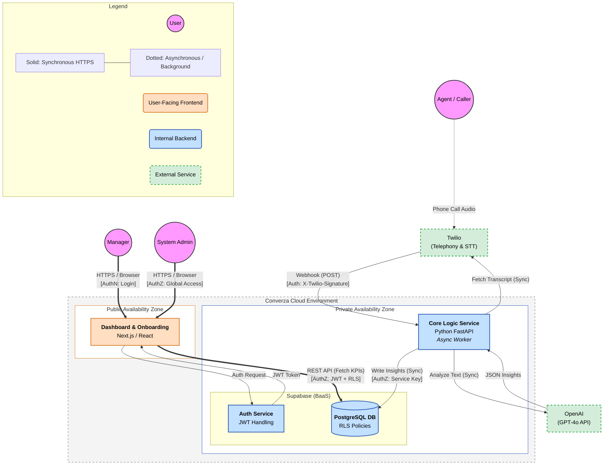
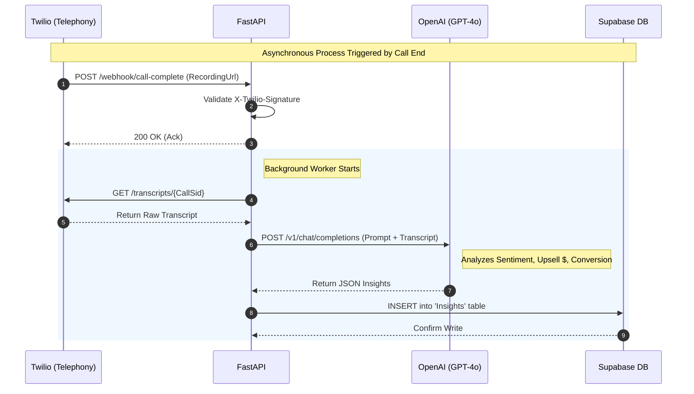
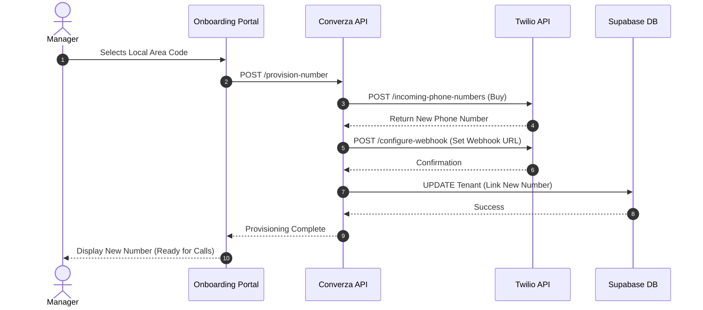
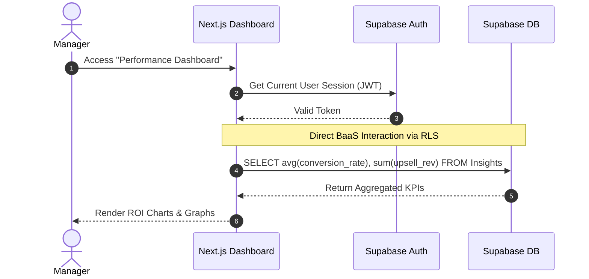
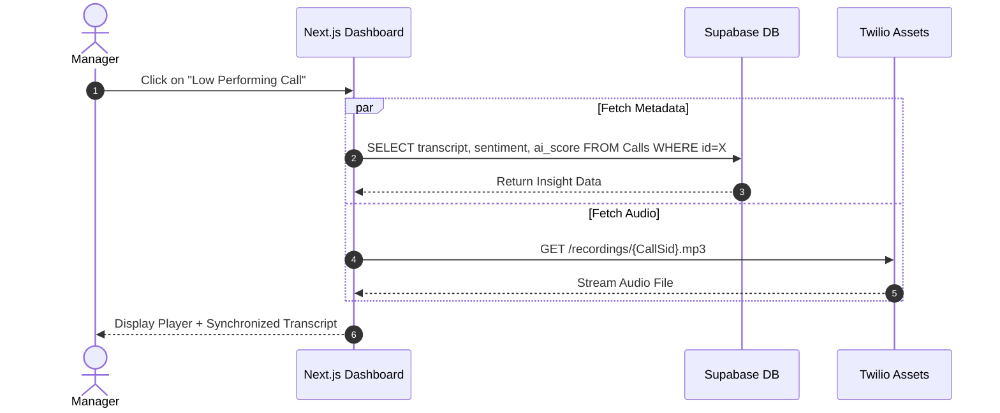

# Converza: Architectural Design Package

## 1. Project Overview

**Converza** is a Call Performance Intelligence Platform that turns the "black box" of customer conversations into clear, actionable insights.

The platform is built for businesses that rely on phone-based sales and support. The system connects with Twilio to ingest live calls, uses AI to analyze revenue outcomes (like upsells and conversions) and sentiment, and delivers those metrics in a unified dashboard for management.

This project serves as a proof-of-concept for the "Insight Engine"—the core pipeline that transforms raw audio into structured business intelligence.

---

## 2. System Elements

### 2.1 Users
*   **Manager (Primary):** The main user. They log in to track team performance, review specific call recordings, and analyze ROI metrics.
*   **System Admin (Internal):** Responsible for tenant management and monitoring API usage (OpenAI/Twilio) to keep the system healthy and cost-effective.
*   **Agent (Passive):** The employees making the calls. They don't log in directly but exist as data points linked to performance metrics.

### 2.2 Frontends
*   **Manager Dashboard (Web App):** A Next.js (React) application that serves as the main interface for the "Performance Insight Dashboard".
*   **Onboarding Portal:** A public-facing flow where managers can easily provision their Twilio numbers to kick off the pilot.

### 2.3 Backends
*   **Core Logic Service (Python/FastAPI):** The brain of the operation. It handles Twilio webhooks, cleans up transcripts, and manages prompt engineering for the OpenAI integration.
*   **BaaS / Data Service (Supabase):** The system uses Supabase to handle Authentication, the Database (PostgreSQL), and Object Storage, avoiding the need to reinvent the wheel on infrastructure.

### 2.4 External Integrations
*   **Twilio (Telephony & STT):** Handles the actual call recording and initial Speech-to-Text transcription.
*   **OpenAI (Intelligence Engine):** The GPT-4o API is used to analyze unstructured text for sentiment, conversion success, and script adherence.

### 2.5 Local Data Store & Entities
**Database:** PostgreSQL (via Supabase).

**Key Entities:**
*   `Tenants` (Organizations)
*   `Users` (Managers)
*   `Agents` (Employees)
*   `Calls` (Metadata like duration and timestamps)
*   `Transcripts` (Raw text)
*   `Insights` (AI outputs: Sentiment, Conversion Boolean, Upsell $)

---

## 3. Architectural Patterns

### 3.1 High-Level Pattern: Event-Driven Service Oriented
The system adopts a hybrid **Service-Oriented Architecture (SOA)**. It is not a monolith, but avoids overcomplication with full microservices.

*   **Frontend-Backend Separation:** The Next.js frontend is completely decoupled from the logic and communicates via REST.
*   **Event-Driven Pipeline:** The core value (analysis) is triggered by external events (webhooks) rather than direct user requests.

### 3.2 Decomposition Pattern
*   **Backend as a Service (BaaS):** Supabase is leveraged for "commoditized" features like Auth and standard CRUD APIs to speed up MVP delivery.
*   **Specialized Compute Service:** The Python FastAPI service acts as a specialized worker node for the "Call Analysis Pipeline." This is separated because it requires heavy compute libraries and has different scaling needs compared to simple CRUD operations.

### 3.3 Scaling Strategy
*   **Horizontal Scaling:** The Python Logic Service is stateless. As call volume grows, more FastAPI instances can be added behind a load balancer to handle the influx of Twilio webhooks.
*   **Asynchronous Processing:** By decoupling call completion (Webhook) from analysis (AI Processing), the system ensures it doesn't lock up during traffic spikes.

---

## 4. Intra-system Communication

### 4.1 Communication Styles

| Interaction | Style | Protocol | Reasoning |
| :--- | :--- | :--- | :--- |
| **Dashboard $\leftrightarrow$ Supabase** | **Synchronous** | REST/HTTPS | Managers need to see their data immediately. |
| **Twilio $\rightarrow$ Logic Service** | **Asynchronous** | Webhook (HTTP) | Twilio pushes data when a call ends; the system acknowledges receipt instantly and processes it in the background. |
| **Logic Service $\rightarrow$ OpenAI** | **Synchronous** | REST/HTTPS | The service waits for the LLM response, but this happens inside a background worker so the main thread stays free. |
| **Logic Service $\rightarrow$ Database** | **Synchronous** | SQL/TCP | Analysis results are written directly to Postgres once processing is done. |

### 4.2 The Asynchronous Call Pipeline (Core Feature)
1.  **Trigger:** Twilio sends a `POST` webhook to indicate a recording is ready.
2.  **Ack:** FastAPI responds with a `200 OK` immediately (latency < 200ms).
3.  **Process:** A background task kicks off:
    *   Fetch the transcript from Twilio.
    *   Send it to OpenAI (GPT-4o).
    *   Parse the JSON response.
    *   Write `Call_Insights` to Supabase.
4.  **Update:** The Dashboard (Next.js) re-fetches the data or receives a real-time update via Supabase to show the new stats.

---

## 5. Authentication & Authorization (AuthN/AuthZ)

### 5.1 Authentication (AuthN)
*   **User Login:** Handled entirely by **Supabase Auth**. Managers get a JSON Web Token (JWT) when they log in.
*   **Service Verification:** The FastAPI Logic Service authenticates requests from Twilio by validating the **X-Twilio-Signature** header. This ensures only expensive AI pipelines are run for legitimate Twilio calls.

### 5.2 Authorization (AuthZ)
*   **Multi-Tenancy (Row Level Security):** This is critical. A manager from "Company A" should never see calls from "Company B." This is enforced using strict **PostgreSQL RLS policies** in Supabase.
    *   *Rule:* `SELECT * FROM calls WHERE tenant_id = auth.uid().organization_id`
*   **Role-Based Access:**
    *   **Admins:** Global Read/Write.
    *   **Managers:** Scoped Read/Write (Own Tenant only).
    *   **Public (Unauthenticated):** Access restricted to Marketing and Login pages.
## 6. Architecture

## 7. User Flows
* Manager Authentication: A manager logs in to access their secure environment.
* Frictionless Onboarding (Twilio Provisioning): A manager selects and provisions a phone number to begin the pilot immediately.
* Agent Call Handling (Passive): An agent accepts a call on the provisioned line; the system passively records it.
* Call Completion & Webhook Trigger: Twilio detects the call end and notifies our system to begin ingestion.
* AI Insight Generation: The system processes the raw transcript to extract ROI metrics (Upsell $, Sentiment) using GPT-4o.
* Dashboard KPI Retrieval: The manager loads the dashboard to view aggregated performance metrics (Conversion Rate, Revenue).
* Coaching Drill-Down: The manager selects a specific low-performing call to review the recording and transcript.
* Admin Usage Monitoring: Internal admins track API costs (OpenAI/Twilio) to ensure we maintain our 80% Gross Margin target.

### AI Insight Generation

### Frictionless Onboarding

### Dashboard KPI Retrieval

### Coaching Drill-Down

